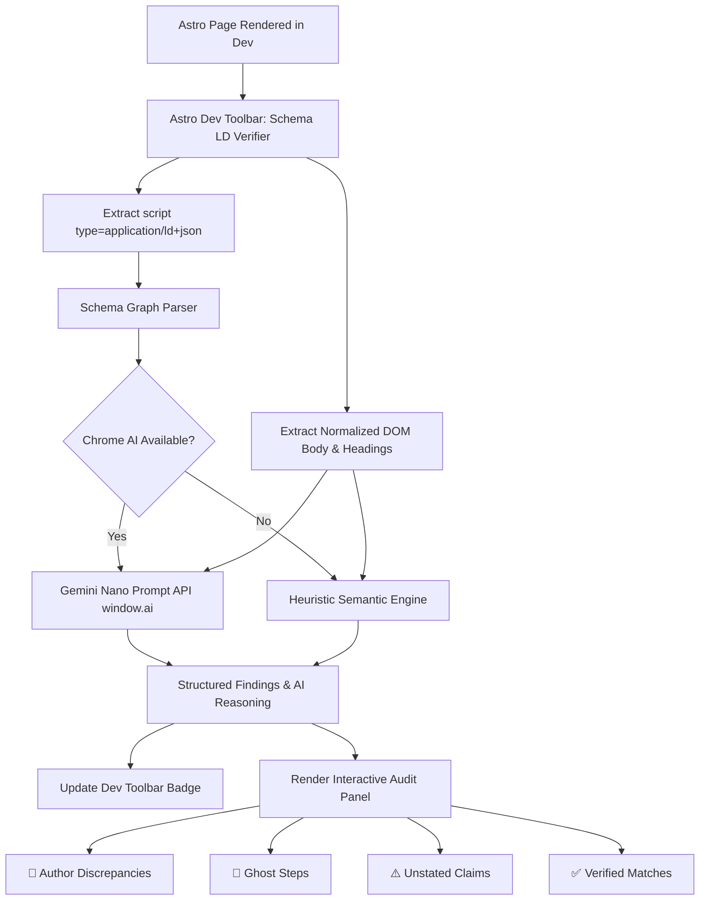

# astro-schema-ld-verifier ⚡

[](https://www.npmjs.com/package/astro-schema-ld-verifier)
[](https://astro.build)
[](https://developer.chrome.com/docs/ai/built-in)
[](https://www.typescriptlang.org)
[](LICENSE)

> Dev-time validation **Astro Dev Toolbar** plugin that audits whether rendered page semantics (JSON-LD `<script type="application/ld+json">`) accurately reflect the article/page's actual DOM content using on-device **Gemini Nano** (`window.ai.languageModel`).

Flag missing entities, mismatched authors, unstated claims, fabricated product prices, and ghost steps before publishing to production!

---

## 🌟 Features

- 🤖 **On-Device Gemini Nano Verification**: Uses Chrome Built-in AI (`window.ai.languageModel`) to perform semantic comparison between DOM text and JSON-LD schema graphs without sending data to external APIs.
- 👤 **Author & Creator Mismatch Detection**: Flags discrepancies when the JSON-LD `author` contradicts the rendered page byline or author bio.
- 👻 **Ghost Step & Recipe Auditing**: Catches instructional steps or recipe directions listed in structured data that are missing from visible page content.
- ⚠️ **Unstated Claims & Hallucinations**: Identifies fabricated product prices, ratings, FAQ items, and claims not supported by the DOM.
- 🛡️ **Resilient Heuristic Fallback**: Includes a fast regex/DOM heuristics engine that validates schemas even when Chrome AI is disabled or unavailable.
- 🌳 **Interactive Schema Tree Explorer**: Inspect full Schema.org graphs, properties, and `@id` trees directly within the Astro Dev Toolbar.
- ⚡ **Zero-Config Astro 5+ Integration**: One line setup in `astro.config.mjs`.

---

## 🏗️ Architecture Flow



---

## 📦 Installation

Install `astro-schema-ld-verifier` as a development dependency:

```bash
# Using bun
bun add -d astro-schema-ld-verifier

# Using pnpm
pnpm add -D astro-schema-ld-verifier

# Using npm
npm install --save-dev astro-schema-ld-verifier
```

---

## 🚀 Quick Setup

Add the integration into your `astro.config.mjs`:

```javascript
import { defineConfig } from 'astro/config';
import schemaLdVerifier from 'astro-schema-ld-verifier';

export default defineConfig({
  integrations: [
    schemaLdVerifier({
      // Options are optional
      autoVerify: true,
      fallbackToHeuristics: true,
      temperature: 0.1,
    }),
  ],
});
```

Start your dev server:

```bash
bun run dev
```

Click on the **Schema.org LD Verifier** icon in the Astro Dev Toolbar to inspect your page!

---

## 🌐 Chrome Built-in AI Prerequisites (Gemini Nano)

To utilize local AI-driven semantic reasoning with Gemini Nano:

1. **Use Google Chrome 128+** (Dev, Canary, or Stable with experimental AI features).
2. Enable the required flags in Chrome:
   - Navigate to `chrome://flags/#prompt-api-for-gemini-nano` and select **Enabled**.
   - Navigate to `chrome://flags/#optimization-guide-on-device-model` and select **Enabled BypassPerfRequirement**.
3. Relaunch Chrome.
4. Navigate to `chrome://components` and ensure **Optimization Guide On Device Model** is downloaded and up to date.

> **Note**: If Chrome AI flags are disabled or unsupported on the current machine, `astro-schema-ld-verifier` automatically activates its built-in **Heuristic Semantic Engine**, ensuring continuous validation without breaking dev workflow.

---

## 🎯 Supported Schema.org Types

| Schema Type | Validation Rules Applied |
| :--- | :--- |
| **`Article` / `BlogPosting` / `NewsArticle`** | Validates headline against `<h1>`/`<title>`, matches author against DOM byline/rel tags, checks published/modified date context. |
| **`HowTo` / `Recipe`** | Checks all `step` and `recipeInstructions` items against visible list items and DOM text to eliminate **ghost steps**. |
| **`FAQPage`** | Verifies that all `Question` names and `acceptedAnswer` texts appear on the rendered page. |
| **`Product` / `Offer`** | Checks pricing (`offers.price`), currency, availability, and item conditions against visible DOM strings. |
| **`Event`** | Confirms event name, location, and dates are present in body text. |
| **`Organization` / `WebSite` / `Person`** | Validates names, URLs, and entity descriptors against page headings and footer elements. |

---

## ⚙️ Configuration Options

| Option | Type | Default | Description |
| :--- | :--- | :--- | :--- |
| `enabled` | `boolean` | `true` | Enable or disable the dev toolbar app integration. |
| `fallbackToHeuristics` | `boolean` | `true` | Fallback to regex and heuristic analysis when Gemini Nano is unavailable. |
| `temperature` | `number` | `0.1` | Temperature for Gemini Nano model generation (lower = higher precision). |
| `maxBodyLength` | `number` | `6000` | Max character count of rendered DOM body sent into verification prompt. |
| `autoVerify` | `boolean` | `true` | Automatically run audit when the dev page loads. |
| `logToConsole` | `boolean` | `true` | Log verification reports to the browser console. |

---

## 💻 Programmatic API Usage

You can also use the extraction and verification functions directly in test suites, SSR middleware, or CLI pipelines:

```typescript
import {
  extractJsonLdScripts,
  extractDomContent,
  verifySchemaLd,
  verifyWithHeuristics,
} from 'astro-schema-ld-verifier';

// Verify an HTML string or document
const html = `
  <html>
    <head>
      <title>Making Espresso</title>
      <script type="application/ld+json">
        {
          "@context": "https://schema.org",
          "@type": "HowTo",
          "name": "Making Espresso",
          "step": [
            { "@type": "HowToStep", "text": "Tamp grounds evenly into portafilter." },
            { "@type": "HowToStep", "text": "Pull shot for 25-30 seconds." }
          ]
        }
      </script>
    </head>
    <body>
      <h1>Making Espresso</h1>
      <ol>
        <li>Tamp grounds evenly into portafilter.</li>
        <li>Pull shot for 25-30 seconds.</li>
      </ol>
    </body>
  </html>
`;

const report = await verifySchemaLd(html);

console.log(report.status); // "passed"
console.log(report.stats); // { totalSchemas: 1, errorsCount: 0, ... }
```

---

## 🧪 Testing

Run unit tests with [Bun](https://bun.sh):

```bash
bun test
```

Run TypeScript verification:

```bash
bun run typecheck
```

Build distribution bundle:

```bash
bun run build
```

---

## 📄 License

MIT © 2026
